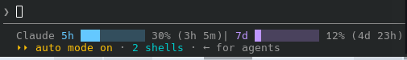
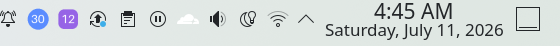
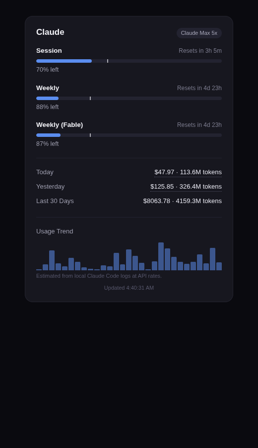

# aiusage

**Track your Claude Code, Codex, and other AI coding subscription usage — from the terminal, a local JSON API, or your system tray. Works on Linux, macOS, and Windows.**

Ever burned through your weekly Claude limit without knowing it was close? `aiusage` reads the same login you already have from Claude Code and shows your session and weekly usage percentages, plus a local spend estimate (today / yesterday / last 30 days) computed entirely from logs already on your machine. No dashboard login, no extra account, no telemetry.

**In Claude Code's own status bar** — live bars, percentages, reset countdowns, and today's spend:



**In your system tray** — session (circle) and weekly (square) badges with the live percentage, color-shifting as you approach limits:



**In a local dashboard** (`http://127.0.0.1:8737`) — pacing projections, per-model spend breakdown, 30-day trend:

<p align="center"></p>

```
$ aiusage status
{
  "providerId": "claude",
  "displayName": "Claude",
  "lines": [
    { "type": "progress", "label": "Session", "used": 3.0, "limit": 100.0 },
    { "type": "progress", "label": "Weekly",  "used": 97.0, "limit": 100.0 },
    { "type": "text", "label": "Today", "value": "$4.48 · 8.4M tokens" }
  ]
}
```

> **"Can't you just use Claude Code's built-in statusline?"** — Yes, and for terminal-only display you should. [Here's the honest breakdown](docs/why.md) of who needs this tool, who doesn't, and what problem each feature solves.

## Features

- **Live Claude usage** — session (5h) and weekly (7d) limits, read via the OAuth login Claude Code already stores locally.
- **Codex too** — if the Codex CLI is installed, its weekly limit, plan, rate-limit reset credits, and local spend show up automatically (auto-detected, zero config).
- **Local spend estimate** — Today / Yesterday / Last 30 Days, computed by scanning your own `~/.claude/projects` session logs. Nothing is uploaded anywhere.
- **System tray icon** — a small ring showing session usage %, color-coded (blue → amber → red), on Linux, macOS, and Windows.
- **Local JSON API** — `GET http://127.0.0.1:8737/v1/usage`, so other local tools/scripts can read your usage numbers. Loopback-only.
- **Zero-config** — if you're already signed in via `claude`, it just works.

## Install

**One command per platform — no Python required** (with Python 3.9+ it installs a lightweight venv; without, it downloads a self-contained binary):

macOS / Linux / WSL:

```bash
curl -fsSL https://raw.githubusercontent.com/ahsanhabibakik/aiusage/main/scripts/install.sh | bash
```

Windows (PowerShell):

```powershell
irm https://raw.githubusercontent.com/ahsanhabibakik/aiusage/main/scripts/install.ps1 | iex
```

Both wire up everything automatically: `aiusage` command, Claude Code status bar, login autostart, and launch the tray immediately. Safe to re-run any time.

**Standalone binaries** (no Python, no install script): grab `aiusage-linux-x86_64`, `aiusage-macos-arm64` (Apple Silicon), or `aiusage-windows-x86_64.exe` from the [latest release](https://github.com/ahsanhabibakik/aiusage/releases/latest). Note: on Linux the binary's tray icon can't use the system AppIndicator libs — prefer the installer with Python there; `serve` + the dashboard work fully either way.

**pip:**

```bash
pip install aiusage-tracker
```

**Homebrew** (macOS/Linux):

```bash
brew install ahsanhabibakik/tap/aiusage-tracker
```

**From source:**

```bash
git clone https://github.com/ahsanhabibakik/aiusage.git
cd aiusage
pip install -e .
```

**Arch Linux:** PKGBUILDs are included in `packaging/aur/` (not yet published to the AUR — needs `python-pystray` first, since pystray has no AUR package of its own). Build `python-pystray` before `aiusage-tracker`:

```bash
cd packaging/aur/python-pystray && makepkg -si
cd ../aiusage-tracker && makepkg -si
```

All methods install the same `aiusage` command.

### Linux tray icon note

Modern desktops (Plasma 6, GNOME, etc.) only show tray icons that speak the **StatusNotifierItem/AppIndicator** protocol — not the older XEmbed one. `pystray` supports both, but picks XEmbed silently if it can't import `gi`/`AppIndicator3`, and an icon made that way will run with no error yet never appear in the panel.

Install the system packages first:

```bash
# Arch
sudo pacman -S python-gobject libappindicator
# Debian/Ubuntu
sudo apt install python3-gi gir1.2-appindicator3-0.1
```

Then create your virtualenv with `--system-site-packages` so it can see them:

```bash
python3 -m venv --system-site-packages .venv
.venv/bin/pip install -e .
.venv/bin/python3 -c "import pystray; print(pystray.Icon.__module__)"
# should print pystray._appindicator, not pystray._xorg
```

If your desktop has no tray support at all, use `aiusage serve` + the local dashboard instead — no system dependency needed.

## Usage

```bash
aiusage status          # print current usage as JSON and exit
aiusage serve            # run the local HTTP API + web dashboard (no tray icon)
aiusage tray             # run the system tray icon + local HTTP API (default experience)
aiusage setup            # wire up Claude Code's statusLine + login autostart
aiusage update           # upgrade to the latest version
```

Open `http://127.0.0.1:8737` in a browser for a small live dashboard while `serve` or `tray` is running.

## Claude Code status bar

`aiusage setup` wires everything up automatically (the installer already runs this for you): adds a `statusLine` to `~/.claude/settings.json` showing live usage right in Claude Code's own status bar, plus login autostart for the tray. It's safe to re-run any time — it never overwrites a *different* statusLine you already have unless you pass `--force`.

```bash
aiusage setup            # wire up statusLine + autostart
aiusage setup --force    # overwrite an existing different statusLine
aiusage statusline        # what settings.json actually runs, one line of output
```

**Important:** to reload after changing `settings.json`, open a **new** Claude Code session — don't run `/statusline`. That command is Claude Code's own status-bar *config wizard*; running it replaces whatever's there (including aiusage's) with its own sample. If that happens, just run `aiusage setup` again.

## Keeping it updated

```bash
aiusage update
```

Tries PyPI first, falls back to the GitHub source. There's no silent background auto-update — a tool that quietly rewrites itself (or your config) without being asked is a real supply-chain risk, not a feature. You'll also get a one-line "update available" notice when running `status`/`serve`/`tray` if a newer version exists.

If you installed via Homebrew or the AUR, use `brew upgrade` / your AUR helper's update flow instead — same idea, just through that package manager.

## Local HTTP API

```
GET http://127.0.0.1:8737/v1/usage
GET http://127.0.0.1:8737/v1/usage/claude
```

Returns a normalized snapshot per provider:

```jsonc
{
  "providerId": "claude",
  "displayName": "Claude",
  "plan": null,
  "lines": [
    { "type": "progress", "label": "Session", "used": 3.0, "limit": 100.0, "format": {"kind": "percent"}, "resets_at": "..." },
    { "type": "text", "label": "Today", "value": "$4.48 · 8.4M tokens" }
  ],
  "fetchedAt": "2026-07-08T19:17:31Z"
}
```

The server listens on `127.0.0.1` only — never reachable from other machines on your network.

## How credentials are read

`aiusage` never asks you to paste a token. It checks, in order:

1. `~/.claude/.credentials.json` (or `$CLAUDE_CONFIG_DIR/.credentials.json`) — the file Claude Code itself writes after `claude` login.
2. `CLAUDE_CODE_OAUTH_TOKEN` environment variable, as a fallback.

If neither is present, the Session/Weekly lines report "Not logged in" — run `claude` and sign in once.

## Privacy

- Local spend tiles are computed **entirely on your machine** from your own Claude Code session logs — no external calls.
- `status`/`serve`/`tray` make one usage-check request to `api.anthropic.com` (the same one Claude Code's own client makes) and one lightweight, best-effort check to `pypi.org` for a newer version — never on the statusline render path, so it can't slow down your status bar.
- The local HTTP API only ever serves usage numbers, never tokens or credentials, and only listens on loopback.

## Roadmap

- Cursor, OpenRouter, Z.ai providers
- Packaged binaries (no Python required) for macOS/Windows

## Contributing

Issues and PRs welcome — especially new providers. See [Roadmap](#roadmap) for what's missing. Keep new providers read-only against local credentials; no telemetry, no new accounts required.

## License

MIT — see [LICENSE](LICENSE).
